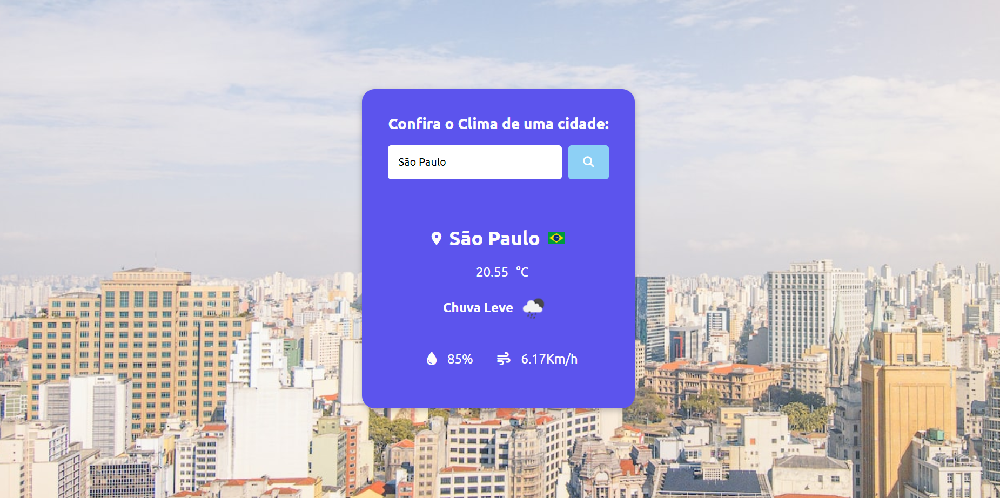

# Climats
 
 <H1>Previsão de clima</H1>
 
 
 

 Projeto inspirado no vídeo do canal <a target="_blank" href="https://www.youtube.com/@MatheusBattisti">Matheus Battisti</a>.

<dl>
 <dt><h2>Tecnologias:</h2></dt> 
  <dd> HTML5</dd>
  <dd> CSS3</dd>
  <dd> JavaScript</dd>
</dl>

<h2>To do:</h2>
 <ul>
 <li>Implementar tratamento de erros</li>
 <li>Criar componente de loading</li>
</ul>
